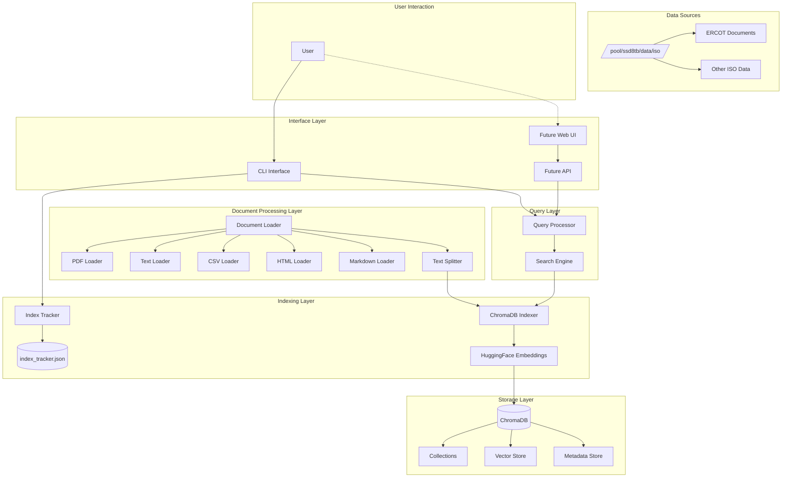

# Energy Data Search - System Architecture

## Table of Contents
1. [System Overview](#system-overview)
2. [Architecture Diagram](#architecture-diagram)
3. [Core Components](#core-components)
4. [Data Flow](#data-flow)
5. [Technology Stack](#technology-stack)
6. [Directory Structure](#directory-structure)
7. [Component Details](#component-details)
8. [Database Design](#database-design)
9. [API Design](#api-design)
10. [Performance Considerations](#performance-considerations)
11. [Security Considerations](#security-considerations)
12. [Scalability](#scalability)

## System Overview

Energy Data Search is a ChromaDB-powered semantic search system designed to index and query large volumes of energy market documents including ISO rules, utility tariffs, proceedings, and time series data. The system uses vector embeddings to enable intelligent document retrieval based on semantic similarity rather than just keyword matching.

### Key Features
- **Incremental Indexing**: Tracks document changes and only processes new/modified files
- **Multi-format Support**: Handles PDF, TXT, CSV, HTML, and Markdown documents
- **Semantic Search**: Uses vector embeddings for intelligent similarity matching
- **Progress Tracking**: Real-time indexing progress with detailed metrics
- **Batch Processing**: Efficient handling of large document collections

## Architecture Diagram



## Core Components

### 1. Document Loader (`loaders/document_loader.py`)
- **Purpose**: Load and process documents from various file formats
- **Responsibilities**:
  - File type detection
  - Format-specific loading
  - Text extraction
  - Chunk splitting
  - Metadata enrichment

### 2. ChromaDB Indexer (`indexers/chromadb_indexer.py`)
- **Purpose**: Manage vector database operations
- **Responsibilities**:
  - Initialize ChromaDB collections
  - Generate embeddings via HuggingFace
  - Batch document insertion
  - Vector similarity search
  - Collection management

### 3. Index Tracker (`utils/index_tracker.py`)
- **Purpose**: Track indexed documents for incremental updates
- **Responsibilities**:
  - File hash computation (SHA256)
  - Modification time tracking
  - Index state persistence
  - Change detection
  - Statistics generation

### 4. Search Engine (`query/search_engine.py`)
- **Purpose**: High-level search interface
- **Responsibilities**:
  - Query processing
  - Result ranking
  - Filter application
  - Multi-directory indexing
  - Statistics aggregation

### 5. Incremental Indexer (`query/incremental_indexer.py`)
- **Purpose**: Efficient document updates
- **Responsibilities**:
  - New file detection
  - Modified file tracking
  - Removed file handling
  - Batch processing
  - Progress reporting

### 6. CLI Interface (`cli/main.py`, `cli/reindex.py`)
- **Purpose**: Command-line user interface
- **Responsibilities**:
  - Command routing
  - User interaction
  - Progress visualization
  - Result formatting
  - Configuration management

## Data Flow

### Indexing Flow
```
1. Document Discovery
   ├── Scan source directories
   ├── Filter by supported extensions
   └── Check against index tracker

2. Document Processing
   ├── Load document content
   ├── Split into chunks (1000 chars, 200 overlap)
   ├── Generate metadata
   └── Compute file hash

3. Embedding Generation
   ├── Load HuggingFace model (all-MiniLM-L6-v2)
   ├── Generate vector embeddings
   └── Normalize embeddings

4. Storage
   ├── Store in ChromaDB collection
   ├── Update index tracker
   └── Persist metadata
```

### Query Flow
```
1. Query Reception
   ├── Parse user query
   ├── Apply filters (directory, file type)
   └── Set parameters (max results, threshold)

2. Vector Search
   ├── Generate query embedding
   ├── Perform similarity search
   └── Retrieve top-k results

3. Result Processing
   ├── Apply score threshold
   ├── Enrich with metadata
   └── Format for display

4. Response
   ├── Return SearchResult objects
   ├── Display in CLI/API
   └── Log statistics
```

## Technology Stack

### Core Technologies
- **Language**: Python 3.12+
- **Package Manager**: UV (universal virtualenv)
- **Build System**: Makefile
- **Virtual Environment**: pyenv

### Key Libraries
- **Vector Database**: ChromaDB 1.0.20+
- **Embeddings**: sentence-transformers 5.1.0+
- **LLM Framework**: LangChain 0.3.27+
- **Document Processing**: 
  - PyPDF 6.0.0+ (PDF)
  - Unstructured 0.18.13+ (HTML/Markdown)
- **CLI**: Click 8.2.1+, Rich 14.1.0+
- **Configuration**: Pydantic 2.11.7+, python-dotenv 1.1.1+

### Storage
- **Vector Store**: ChromaDB (SQLite backend)
- **Metadata**: JSON (index_tracker.json)
- **Configuration**: .env file

## Directory Structure

```
energy-data-search/
├── src/
│   └── energy_data_search/
│       ├── __init__.py
│       ├── __main__.py           # Entry point
│       ├── config.py             # Configuration management
│       ├── cli/
│       │   ├── __init__.py
│       │   ├── main.py          # CLI commands
│       │   └── reindex.py       # Full reindex logic
│       ├── loaders/
│       │   ├── __init__.py
│       │   └── document_loader.py
│       ├── indexers/
│       │   ├── __init__.py
│       │   └── chromadb_indexer.py
│       ├── query/
│       │   ├── __init__.py
│       │   ├── search_engine.py
│       │   └── incremental_indexer.py
│       └── utils/
│           ├── __init__.py
│           └── index_tracker.py
├── data/
│   ├── chroma_db/               # Vector database files
│   │   ├── chroma.sqlite3       # Main database
│   │   └── index_tracker.json   # Document tracking
│   └── test_chroma/             # Test database
├── tests/
│   └── (test files)
├── specs/
│   └── SYSTEM_ARCHITECTURE.md   # This document
├── config/
│   └── (configuration files)
├── .env                         # Environment variables
├── pyproject.toml              # Project configuration
├── Makefile                    # Build automation
├── README.md                   # User documentation
└── REINDEX_GUIDE.md           # Reindexing documentation
```

## Component Details

### Document Loader
```python
class DocumentLoader:
    Attributes:
        chunk_size: int (default: 1000)
        chunk_overlap: int (default: 200)
        text_splitter: RecursiveCharacterTextSplitter
        loader_map: Dict[str, Callable]
    
    Methods:
        load_document(file_path: Path) -> List[Document]
        load_directory(directory: Path, recursive: bool) -> List[Document]
        _load_pdf(file_path: Path) -> List[Document]
        _load_text(file_path: Path) -> List[Document]
        _load_csv(file_path: Path) -> List[Document]
        _load_html(file_path: Path) -> List[Document]
        _load_markdown(file_path: Path) -> List[Document]
```

### ChromaDB Indexer
```python
class ChromaDBIndexer:
    Attributes:
        persist_directory: Path
        collection_name: str
        embeddings: HuggingFaceEmbeddings
        vectorstore: Chroma
    
    Methods:
        add_documents(documents: List[Document], batch_size: int) -> int
        search(query: str, k: int, filter_dict: Dict, score_threshold: float) -> List[Tuple[Document, float]]
        get_collection_stats() -> Dict[str, Any]
        clear_collection() -> None
        update_document(document_id: str, document: Document) -> None
```

### Index Tracker
```python
class IndexTracker:
    Attributes:
        tracker_file: Path
        indexed_files: Dict[str, FileMetadata]
    
    Methods:
        load_tracker() -> None
        save_tracker() -> None
        compute_file_hash(file_path: Path) -> str
        is_file_indexed(file_path: Path) -> bool
        needs_reindex(file_path: Path) -> bool
        mark_indexed(file_path: Path, chunk_count: int) -> None
        get_files_to_index(directory: Path, recursive: bool) -> List[Path]
        get_statistics() -> Dict
```

## Database Design

### ChromaDB Schema
```sql
-- Collections Table
CREATE TABLE collections (
    id TEXT PRIMARY KEY,
    name TEXT UNIQUE NOT NULL,
    metadata TEXT
);

-- Embeddings Table
CREATE TABLE embeddings (
    id TEXT PRIMARY KEY,
    collection_id TEXT,
    embedding BLOB,
    document TEXT,
    metadata TEXT,
    FOREIGN KEY (collection_id) REFERENCES collections(id)
);

-- Indexes
CREATE INDEX idx_collection_name ON collections(name);
CREATE INDEX idx_embeddings_collection ON embeddings(collection_id);
```

### Index Tracker Schema (JSON)
```json
{
    "indexed_files": {
        "/path/to/file.pdf": {
            "file_path": "/path/to/file.pdf",
            "file_hash": "sha256_hash",
            "file_size": 1024000,
            "last_modified": 1692825600.0,
            "indexed_at": "2024-08-23T10:00:00",
            "chunk_count": 42
        }
    },
    "last_updated": "2024-08-23T10:00:00",
    "total_files": 131,
    "total_chunks": 5260
}
```

## API Design

### Search API (Future)
```python
# RESTful API Endpoints
POST   /api/search           # Execute search query
GET    /api/stats            # Get index statistics
POST   /api/index            # Trigger indexing
GET    /api/status           # Get system status
DELETE /api/index            # Clear index
GET    /api/documents/{id}   # Get specific document

# Request/Response Examples
POST /api/search
{
    "query": "BESS battery storage",
    "max_results": 10,
    "filters": {
        "directory": "ERCOT",
        "file_type": "pdf"
    },
    "score_threshold": 0.3
}

Response:
{
    "results": [
        {
            "content": "...",
            "source": "/path/to/doc.pdf",
            "score": 0.85,
            "metadata": {...}
        }
    ],
    "total": 10,
    "query_time": 0.234
}
```

## Performance Considerations

### Indexing Performance
- **Batch Size**: 50 documents per batch (configurable)
- **Chunk Size**: 1000 characters (optimal for embeddings)
- **Chunk Overlap**: 200 characters (context preservation)
- **Processing Speed**: ~1-3 files/second (PDF dependent)
- **Embedding Generation**: CPU-based (GPU optional)

### Query Performance
- **Vector Search**: < 100ms for 10k documents
- **Embedding Cache**: Model loaded once, reused
- **Result Limit**: Default 10, max 100
- **Score Threshold**: 0.3 default (configurable)

### Memory Management
- **Batch Processing**: Prevents memory overflow
- **Streaming**: Large files processed in chunks
- **Garbage Collection**: Explicit cleanup after batches

### Optimization Strategies
1. **Incremental Indexing**: Only process changed files
2. **Hash-based Change Detection**: SHA256 for content changes
3. **Parallel Processing**: Future enhancement for multi-core
4. **Embedding Cache**: Reuse computed embeddings
5. **Database Indexing**: SQLite indexes on key columns

## Security Considerations

### Data Protection
- **File Access**: Read-only access to source documents
- **Permission Checks**: Validate file permissions before access
- **Path Traversal**: Absolute path validation
- **Input Sanitization**: Query parameter validation

### Database Security
- **Local Storage**: No network exposure by default
- **File Permissions**: 755 for directories, 644 for files
- **SQL Injection**: Parameterized queries via ORM
- **Backup Strategy**: Regular database backups recommended

### API Security (Future)
- **Authentication**: JWT tokens
- **Authorization**: Role-based access control
- **Rate Limiting**: Request throttling
- **HTTPS**: Encrypted communication
- **CORS**: Configured origins only

## Scalability

### Current Limitations
- **Single Node**: Local ChromaDB instance
- **CPU Embeddings**: Limited by CPU cores
- **SQLite Backend**: Single writer limitation
- **Memory**: Limited by available RAM

### Scaling Strategies

#### Horizontal Scaling
```
Load Balancer
    ├── API Server 1 → ChromaDB Instance 1
    ├── API Server 2 → ChromaDB Instance 2
    └── API Server 3 → ChromaDB Instance 3
```

#### Vertical Scaling
- **GPU Acceleration**: CUDA-enabled embeddings
- **RAM Upgrade**: Larger embedding cache
- **SSD Storage**: Faster I/O operations
- **Multi-threading**: Parallel document processing

#### Distributed Architecture (Future)
```
┌─────────────────┐
│   Load Balancer │
└────────┬────────┘
         │
    ┌────┴────┐
    │   API   │
    │ Gateway │
    └────┬────┘
         │
┌────────┴────────┬────────────┐
│                 │            │
▼                 ▼            ▼
Search Service  Index Service  Admin Service
      │              │              │
      └──────────┬───────────────┘
                 │
         ┌───────┴────────┐
         │                │
         ▼                ▼
    ChromaDB         Elasticsearch
    (Primary)         (Secondary)
```

### Performance Metrics
| Metric | Current | Target | Max |
|--------|---------|--------|-----|
| Documents | 5,000 | 50,000 | 500,000 |
| Queries/sec | 10 | 100 | 1,000 |
| Index Time | 2 min | 10 min | 60 min |
| Query Latency | 100ms | 50ms | 10ms |
| Storage | 100MB | 1GB | 10GB |

## Monitoring & Observability

### Metrics to Track
- **Indexing**: Files/sec, chunks/sec, errors
- **Queries**: Requests/sec, latency, cache hits
- **Storage**: Database size, document count
- **System**: CPU, memory, disk I/O

### Logging Strategy
```python
# Log Levels
DEBUG:   Detailed diagnostic information
INFO:    General operational messages
WARNING: Potential issues, degraded performance
ERROR:   Errors that need attention
CRITICAL: System failures

# Log Format
[timestamp] [level] [component] message {context}
```

### Health Checks
```python
GET /health
{
    "status": "healthy",
    "components": {
        "database": "ok",
        "embeddings": "ok",
        "storage": "ok"
    },
    "metrics": {
        "documents": 5260,
        "uptime": 3600,
        "last_index": "2024-08-23T10:00:00"
    }
}
```

## Development Workflow

### Local Development
```bash
# Setup
make venv           # Create virtual environment
make install        # Install dependencies

# Development
make run           # Run CLI
make test          # Run tests
make lint          # Check code quality
make format        # Format code

# Database
make full-reindex  # Complete reindex
make update        # Incremental update
make stats         # View statistics
```

### CI/CD Pipeline (Future)
```yaml
stages:
  - lint
  - test
  - build
  - deploy

lint:
  script:
    - make lint
    
test:
  script:
    - make test
    - make test-coverage
    
build:
  script:
    - make build
    - docker build -t energy-search:latest .
    
deploy:
  script:
    - docker push energy-search:latest
    - kubectl apply -f k8s/
```

## Future Enhancements

### Phase 1: Core Improvements
- [ ] GPU-accelerated embeddings
- [ ] Multi-threaded indexing
- [ ] Advanced query parsing
- [ ] Document deduplication

### Phase 2: API & Web
- [ ] RESTful API
- [ ] Web UI (React/Vue)
- [ ] WebSocket for real-time updates
- [ ] User authentication

### Phase 3: Advanced Features
- [ ] Multi-modal search (tables, charts)
- [ ] LLM integration for Q&A
- [ ] Document summarization
- [ ] Named entity recognition
- [ ] Time series analysis

### Phase 4: Enterprise
- [ ] Distributed indexing
- [ ] Multi-tenant support
- [ ] Advanced RBAC
- [ ] Audit logging
- [ ] Compliance features

## Conclusion

The Energy Data Search system provides a robust, scalable architecture for semantic document search in the energy sector. The modular design allows for easy extension and maintenance, while the incremental indexing system ensures efficient resource utilization. The use of ChromaDB and vector embeddings enables sophisticated semantic search capabilities that go beyond traditional keyword matching.