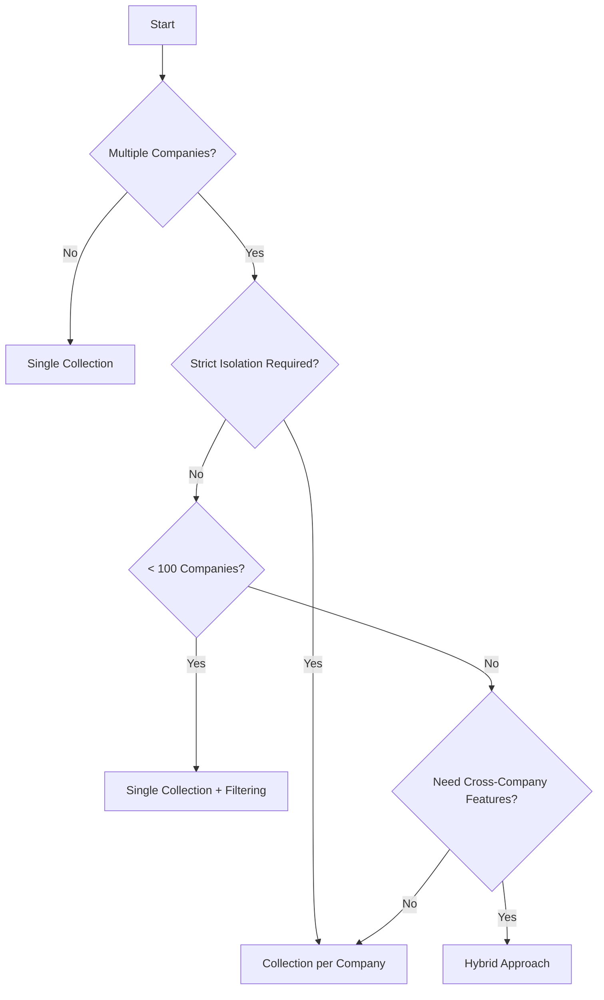

# ChromaDB Multi-Tenant Implementation Guide

## Core Implementation Approaches

### Approach 1: Single Collection with Metadata Filtering (RECOMMENDED)
```python
# ONE collection for all tenants, isolation via metadata
client = chromadb.Client()
collection = client.create_collection("platform_documents")

# Add document with tenant metadata
collection.add(
    documents=["document content"],
    metadatas=[{
        "tenant_id": "company_123",
        "team_ids": ["team_456", "team_789"],
        "user_id": "user_abc",
        "project_id": "project_xyz",
        "access_level": "company",
        "doc_s3_url": "s3://bucket/company_123/docs/file.pdf"
    }],
    ids=["doc_001"]
)

# Query with tenant filter
results = collection.query(
    query_texts=["solar panel efficiency"],
    where={"tenant_id": "company_123"},  # Critical: ALWAYS filter by tenant
    n_results=10
)
```

**Pros:**
- Simple to manage
- Efficient for cross-tenant features (if needed)
- Single index to maintain
- Easier backup/restore

**Cons:**
- Risk of filter bypass (security critical)
- All data in one collection
- Potential performance issues at scale

### Approach 2: Collection per Company (MOST COMMON)
```python
# Separate collection for each company
def get_company_collection(company_id):
    collection_name = f"company_{company_id}"
    return client.get_or_create_collection(collection_name)

# Add document to company collection
company_collection = get_company_collection("company_123")
company_collection.add(
    documents=["document content"],
    metadatas=[{
        "team_ids": ["team_456"],
        "project_id": "project_xyz",
        "doc_s3_url": "s3://bucket/company_123/docs/file.pdf"
    }],
    ids=["doc_001"]
)
```

**Pros:**
- Strong isolation between companies
- Can scale independently
- Easy to delete company data
- Better performance per company

**Cons:**
- More collections to manage
- Complex cross-company features
- More overhead for small companies

### Approach 3: Hierarchical Collections (COMPLEX BUT FLEXIBLE)
```python
# Different collections for different scopes
collections = {
    "global": client.create_collection("global_energy_data"),
    "company": client.create_collection(f"company_{company_id}"),
    "projects": client.create_collection(f"company_{company_id}_projects"),
    "documents": client.create_collection(f"company_{company_id}_documents")
}

# Search across multiple collections
def multi_collection_search(query, company_id):
    results = []
    
    # Search global data
    results.extend(collections["global"].query(query_texts=[query]))
    
    # Search company-specific collections
    results.extend(collections["company"].query(query_texts=[query]))
    results.extend(collections["projects"].query(query_texts=[query]))
    
    return merge_and_rank_results(results)
```

## Document Storage Architecture

### S3 + ChromaDB Pattern (RECOMMENDED)

```python
# ChromaDB stores embeddings + metadata
# S3 stores actual documents

class DocumentPipeline:
    def process_document(self, file, company_id, project_id):
        # 1. Upload original to S3
        s3_key = f"{company_id}/projects/{project_id}/docs/{file.name}"
        s3_url = s3_client.upload(file, bucket="platform-docs", key=s3_key)
        
        # 2. Extract text for embedding
        text_content = extract_text(file)  # PyPDF2, python-docx, etc.
        
        # 3. Generate embeddings and store in ChromaDB
        collection.add(
            documents=[text_content],
            metadatas=[{
                "tenant_id": company_id,
                "project_id": project_id,
                "s3_url": s3_url,
                "s3_bucket": "platform-docs",
                "s3_key": s3_key,
                "file_name": file.name,
                "file_size": file.size,
                "content_type": file.content_type,
                "checksum": calculate_md5(file)
            }],
            ids=[generate_doc_id()]
        )
        
        # 4. Optional: Store preview/thumbnail
        if file.type == "pdf":
            thumbnail = generate_thumbnail(file)
            s3_client.upload(thumbnail, key=f"{s3_key}.thumb.png")
```

### Storage Options Comparison

| Storage Component | Where | What | Why |
|------------------|-------|------|-----|
| **Original Files** | S3 | PDFs, DOCX, Images | Cheap, scalable, CDN-ready |
| **Embeddings** | ChromaDB | Vector representations | Fast similarity search |
| **Metadata** | ChromaDB | Searchable attributes | Filtering & access control |
| **Text Content** | ChromaDB (optional) | Extracted text | Full-text search capability |
| **Previews** | S3 | Thumbnails, summaries | Quick display without download |

## Practical Implementation Patterns

### 1. Tenant Isolation Pattern
```python
class TenantAwareChroma:
    def __init__(self, company_id):
        self.company_id = company_id
        self.collection = self._get_collection()
    
    def _get_collection(self):
        # Option A: Single collection with forced filtering
        return ChromaSecureProxy(
            collection=client.get_collection("platform"),
            default_filter={"tenant_id": self.company_id}
        )
        
        # Option B: Company-specific collection
        return client.get_or_create_collection(f"company_{self.company_id}")
    
    def search(self, query, additional_filters=None):
        filters = {"tenant_id": self.company_id}
        if additional_filters:
            filters.update(additional_filters)
        
        return self.collection.query(
            query_texts=[query],
            where=filters
        )
```

### 2. Document Processing Pipeline
```python
class DocumentProcessor:
    def __init__(self, s3_client, chroma_collection):
        self.s3 = s3_client
        self.chroma = chroma_collection
        
    async def process_upload(self, file, metadata):
        # Step 1: Upload to S3
        s3_path = self._generate_s3_path(metadata)
        s3_url = await self.s3.upload_async(file, s3_path)
        
        # Step 2: Extract content
        text = await self._extract_text_async(file)
        chunks = self._chunk_text(text, chunk_size=1000, overlap=200)
        
        # Step 3: Generate embeddings and store
        for i, chunk in enumerate(chunks):
            self.chroma.add(
                documents=[chunk],
                metadatas=[{
                    **metadata,
                    "s3_url": s3_url,
                    "chunk_index": i,
                    "total_chunks": len(chunks)
                }],
                ids=[f"{metadata['doc_id']}_chunk_{i}"]
            )
        
        return {"doc_id": metadata['doc_id'], "s3_url": s3_url}
```

### 3. Hybrid Search Implementation
```python
class HybridSearch:
    def __init__(self, chroma_client, s3_client):
        self.chroma = chroma_client
        self.s3 = s3_client
    
    def search(self, query, company_id, search_type="hybrid"):
        # Vector search in ChromaDB
        vector_results = self.chroma.query(
            query_texts=[query],
            where={"tenant_id": company_id},
            include=["metadatas", "distances", "documents"]
        )
        
        # Optional: Metadata filtering
        if search_type == "hybrid":
            # Apply additional business logic filters
            filtered_results = self._apply_business_rules(vector_results)
        else:
            filtered_results = vector_results
        
        # Enrich with S3 URLs for document retrieval
        for result in filtered_results:
            result["download_url"] = self.s3.generate_presigned_url(
                result["metadata"]["s3_key"],
                expiration=3600  # 1 hour
            )
        
        return filtered_results
```

## Collection Strategy Decision Tree



## Best Practices for Production

### 1. Security Implementation
```python
# ALWAYS validate tenant access
class SecureChromaWrapper:
    def query(self, query_text, user_context, **kwargs):
        # Force tenant filter
        if 'where' not in kwargs:
            kwargs['where'] = {}
        
        # Merge with required security filters
        kwargs['where'] = {
            "$and": [
                {"tenant_id": user_context.company_id},
                kwargs.get('where', {})
            ]
        }
        
        # Log access for audit
        self.audit_log.record(
            user=user_context.user_id,
            action="search",
            query=query_text,
            filters=kwargs['where']
        )
        
        return self.collection.query(query_text, **kwargs)
```

### 2. S3 Organization
```
s3://your-bucket/
├── company_{id}/
│   ├── projects/
│   │   ├── {project_id}/
│   │   │   ├── documents/
│   │   │   ├── images/
│   │   │   └── reports/
│   ├── shared/
│   └── archive/
├── global/
│   ├── energy_data/
│   └── regulations/
└── temp/
    └── processing/
```

### 3. Chunking Strategy
```python
def intelligent_chunking(document_text, doc_type):
    if doc_type == "contract":
        # Keep sections together
        return chunk_by_sections(document_text, max_size=1500)
    elif doc_type == "technical_spec":
        # Smaller chunks for detailed search
        return chunk_with_overlap(document_text, size=500, overlap=100)
    elif doc_type == "report":
        # Chapter-based chunking
        return chunk_by_chapters(document_text)
    else:
        # Default sliding window
        return chunk_with_overlap(document_text, size=1000, overlap=200)
```

### 4. Performance Optimization
```python
# Batch operations for multiple documents
def batch_index_documents(documents, company_id):
    batch_size = 100
    
    for i in range(0, len(documents), batch_size):
        batch = documents[i:i+batch_size]
        
        # Prepare batch data
        texts = []
        metadatas = []
        ids = []
        
        for doc in batch:
            # Upload to S3 in parallel
            s3_url = async_upload_to_s3(doc)
            
            # Extract and chunk
            chunks = process_document(doc)
            
            for chunk in chunks:
                texts.append(chunk.text)
                metadatas.append({
                    "tenant_id": company_id,
                    "s3_url": s3_url,
                    **chunk.metadata
                })
                ids.append(chunk.id)
        
        # Single batch insert
        collection.add(
            documents=texts,
            metadatas=metadatas,
            ids=ids
        )
```

## Common Pitfalls to Avoid

1. **Don't store large files in ChromaDB** - Use S3 for files, ChromaDB for searchable text/embeddings
2. **Don't forget tenant filtering** - Every query must include tenant isolation
3. **Don't create too many collections** - ChromaDB has overhead per collection
4. **Don't ignore chunking** - Large documents need intelligent splitting
5. **Don't skip access logging** - Audit trails are critical for compliance

## Recommended Architecture for Your Use Case

```python
# For your energy platform, I recommend:

1. Collection Strategy: Collection per Company
   - company_{id}_documents
   - company_{id}_projects
   - global_energy_data

2. Storage: S3 for documents, ChromaDB for search
   - S3: Original PDFs, images, reports
   - ChromaDB: Embeddings + extracted text + metadata

3. Access Pattern: API Gateway with tenant validation
   - Every request validated at API level
   - ChromaDB queries always include tenant filter
   - S3 presigned URLs for document access

4. Scaling: Start simple, evolve as needed
   - Begin with collection per company
   - Add caching layer when needed
   - Consider sharding at 1000+ companies
```