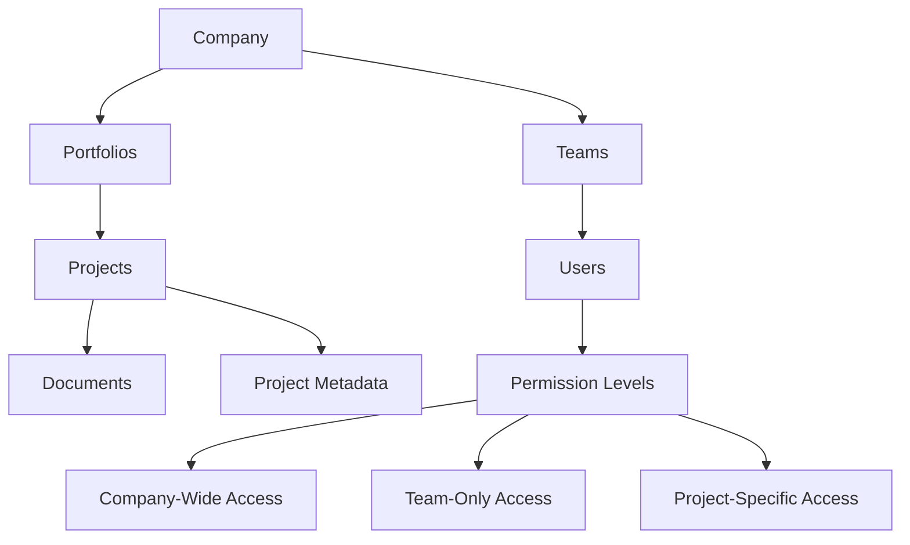

# ChromaDB Multi-Tenant Document Management System Design

## Overview
Design pattern for implementing a secure, multi-tenant document and information management system using ChromaDB that enables AI-powered search across project data, customer documents, and organizational information while maintaining strict data isolation between companies.

## Architecture Components

### 1. Collection Strategy
```
chromadb/
├── global/                    # Centralized energy data
│   ├── ercot_market_rules
│   ├── utility_rates
│   └── incentive_programs
│
└── tenant/                     # Customer-specific data
    ├── company_{uuid}/
    │   ├── projects
    │   ├── documents
    │   ├── portfolios
    │   └── metadata
    │
    └── shared_{uuid}/          # Cross-company collaborations
        └── joint_ventures
```

### 2. Data Hierarchy & Access Control



### 3. Collection Naming Convention

```python
# Collection naming pattern
{scope}_{tenant_id}_{resource_type}_{optional_subset}

# Examples:
company_abc123_projects
company_abc123_documents
team_xyz789_projects
user_personal_notes
global_ercot_rules
```

### 4. Metadata Schema

```json
{
  "document_id": "uuid",
  "tenant_id": "company_uuid",
  "team_ids": ["team1_uuid", "team2_uuid"],
  "user_id": "uploader_uuid",
  "project_id": "project_uuid",
  "portfolio_id": "portfolio_uuid",
  
  "access_control": {
    "visibility": "company|team|project|private",
    "shared_with_teams": ["team_uuid"],
    "shared_with_users": ["user_uuid"],
    "external_shares": []
  },
  
  "document_metadata": {
    "type": "contract|design|permit|invoice|report",
    "upload_date": "2024-01-01T00:00:00Z",
    "file_name": "original_filename.pdf",
    "file_size": 1024000,
    "mime_type": "application/pdf"
  },
  
  "project_metadata": {
    "project_type": "solar|wind|battery|efficiency",
    "location": {
      "address": "123 Main St",
      "city": "Austin",
      "state": "TX",
      "zip": "78701",
      "coordinates": [30.2672, -97.7431]
    },
    "building_type": "commercial|residential|industrial",
    "system_size_kw": 500,
    "incentives_used": ["ITC", "PTC", "local_rebate"],
    "utility": "Austin Energy",
    "interconnection_date": "2024-06-01"
  },
  
  "searchable_content": {
    "title": "Document or Project Title",
    "description": "Brief description",
    "tags": ["solar", "commercial", "austin"],
    "extracted_text": "OCR or parsed content",
    "ai_summary": "AI-generated summary"
  },
  
  "audit": {
    "created_at": "2024-01-01T00:00:00Z",
    "created_by": "user_uuid",
    "updated_at": "2024-01-02T00:00:00Z",
    "updated_by": "user_uuid",
    "version": 1
  }
}
```

### 5. Security & Isolation Pattern

```python
# Pseudo-code for secure query construction
class SecureChromaQuery:
    def build_filter(user_context):
        base_filter = {
            "$or": [
                {"tenant_id": user_context.company_id},
                {"access_control.shared_with_users": {"$contains": user_context.user_id}},
                {"team_ids": {"$contains": user_context.team_ids}}
            ]
        }
        
        # Apply additional visibility filters
        if user_context.access_level == "team":
            base_filter["$and"] = [
                {"access_control.visibility": {"$in": ["company", "team"]}}
            ]
        
        return base_filter
```

### 6. Multi-Collection Search Strategy

```python
# Search across multiple collections with proper access control
class MultiTenantSearch:
    def search(query, user_context):
        collections_to_search = []
        
        # Always search global collections
        collections_to_search.append("global_energy_data")
        
        # Add company-specific collections
        collections_to_search.append(f"company_{user_context.company_id}_projects")
        collections_to_search.append(f"company_{user_context.company_id}_documents")
        
        # Add team collections if applicable
        for team_id in user_context.team_ids:
            collections_to_search.append(f"team_{team_id}_projects")
        
        # Execute parallel searches with filters
        results = parallel_search(
            collections=collections_to_search,
            query=query,
            filters=build_security_filters(user_context)
        )
        
        return aggregate_and_rank(results)
```

### 7. Embedding Strategy

```yaml
embedding_model: "text-embedding-3-large"
embedding_dimensions: 1536

content_preparation:
  - extract_text_from_documents
  - generate_ai_summaries
  - extract_structured_metadata
  - combine_into_searchable_chunks

chunk_strategy:
  max_chunk_size: 1000
  chunk_overlap: 200
  preserve_context: true
  
indexing_priority:
  - project_metadata
  - document_summaries
  - full_text_content
  - associated_communications
```

### 8. Data Lifecycle Management

```yaml
retention_policies:
  active_projects:
    retention: indefinite
    indexing: full
    
  completed_projects:
    retention: 7_years
    indexing: metadata_only_after_1_year
    
  archived_documents:
    retention: as_per_compliance
    indexing: on_demand
    
backup_strategy:
  frequency: daily
  incremental: true
  collections_snapshot: weekly
  
cleanup_operations:
  - remove_orphaned_embeddings
  - consolidate_duplicate_documents
  - update_stale_metadata
```

### 9. Query Patterns

```python
# Common query patterns

# 1. Project-specific search
def search_within_project(project_id, query, user_context):
    filter = {
        "project_id": project_id,
        **build_access_filter(user_context)
    }
    return collection.query(query_texts=[query], where=filter)

# 2. Cross-portfolio analysis
def search_across_portfolios(portfolio_ids, query, user_context):
    filter = {
        "portfolio_id": {"$in": portfolio_ids},
        **build_access_filter(user_context)
    }
    return collection.query(query_texts=[query], where=filter)

# 3. Incentive program search
def find_projects_by_incentive(incentive_type, user_context):
    filter = {
        "project_metadata.incentives_used": {"$contains": incentive_type},
        **build_access_filter(user_context)
    }
    return collection.query(where=filter)

# 4. Geographic search
def search_by_location(coordinates, radius_km, query, user_context):
    # Implement geospatial filtering
    pass

# 5. Temporal search
def search_by_date_range(start_date, end_date, query, user_context):
    filter = {
        "project_metadata.interconnection_date": {
            "$gte": start_date,
            "$lte": end_date
        },
        **build_access_filter(user_context)
    }
    return collection.query(query_texts=[query], where=filter)
```

### 10. Performance Optimization

```yaml
optimization_strategies:
  indexing:
    - use_vector_indices_for_similarity
    - create_metadata_indices_for_filtering
    - implement_hierarchical_navigable_small_world_graphs
    
  caching:
    - cache_frequent_queries
    - cache_user_context_filters
    - implement_embedding_cache
    
  partitioning:
    - partition_by_tenant_for_large_deployments
    - separate_hot_and_cold_data
    - implement_time_based_partitioning
    
  query_optimization:
    - limit_initial_results_with_pagination
    - use_approximate_nearest_neighbors
    - implement_query_result_ranking
```

### 11. Integration Points

```yaml
api_endpoints:
  document_management:
    - POST /api/documents/upload
    - GET /api/documents/search
    - PUT /api/documents/{id}/metadata
    - DELETE /api/documents/{id}
    
  project_management:
    - POST /api/projects/{id}/associate-document
    - GET /api/projects/{id}/documents
    - GET /api/projects/search
    
  cross_tenant_sharing:
    - POST /api/sharing/create-link
    - PUT /api/sharing/permissions
    - GET /api/sharing/accessible-resources

webhook_events:
  - document.uploaded
  - document.processed
  - project.created
  - metadata.updated
  - embedding.completed
```

### 12. Compliance & Audit

```yaml
compliance_features:
  data_residency:
    - enforce_geographic_restrictions
    - maintain_data_locality_metadata
    
  access_logging:
    - log_all_search_queries
    - track_document_access
    - maintain_permission_change_history
    
  data_privacy:
    - implement_right_to_be_forgotten
    - support_data_export_requests
    - enable_consent_management
    
  encryption:
    - encrypt_embeddings_at_rest
    - use_field_level_encryption_for_sensitive_metadata
    - implement_key_rotation
```

### 13. Scalability Considerations

```yaml
horizontal_scaling:
  - implement_collection_sharding_by_tenant
  - use_read_replicas_for_search
  - implement_write_through_cache
  
vertical_scaling:
  - optimize_embedding_dimensions
  - implement_progressive_indexing
  - use_quantization_for_large_collections
  
federation:
  - support_multi_region_deployment
  - implement_cross_region_replication
  - enable_federated_search
```

### 14. Error Handling & Recovery

```yaml
error_scenarios:
  embedding_failure:
    - retry_with_exponential_backoff
    - queue_for_batch_processing
    - maintain_partial_index
    
  permission_conflicts:
    - default_to_most_restrictive
    - log_permission_denials
    - provide_clear_error_messages
    
  collection_corruption:
    - maintain_backup_collections
    - implement_consistency_checks
    - support_point_in_time_recovery
```

## Implementation Roadmap

### Phase 1: Foundation (Weeks 1-4)
- Set up ChromaDB infrastructure
- Implement basic tenant isolation
- Create document upload and indexing pipeline
- Build basic search API

### Phase 2: Access Control (Weeks 5-8)
- Implement comprehensive permission system
- Add team and user-level access controls
- Create audit logging system
- Build sharing functionality

### Phase 3: Advanced Features (Weeks 9-12)
- Implement cross-portfolio search
- Add geographic and temporal search
- Build AI summarization pipeline
- Create advanced analytics endpoints

### Phase 4: Optimization (Weeks 13-16)
- Performance tuning and caching
- Implement scalability features
- Add monitoring and alerting
- Conduct security audit

## Key Design Decisions

1. **Collection per Tenant**: Each company gets its own collection(s) for complete data isolation
2. **Metadata-Driven Access Control**: All access control is enforced through metadata filters
3. **Hybrid Search**: Combine vector similarity with metadata filtering for precise results
4. **Progressive Enhancement**: Start with basic features and progressively add advanced capabilities
5. **Security First**: Every query includes access control filters, no exceptions

## Success Metrics

- Search latency < 200ms for 95th percentile
- Document processing time < 30 seconds
- 99.9% uptime for search functionality
- Zero cross-tenant data leaks
- Support for 10,000+ concurrent users
- Index 1M+ documents per tenant