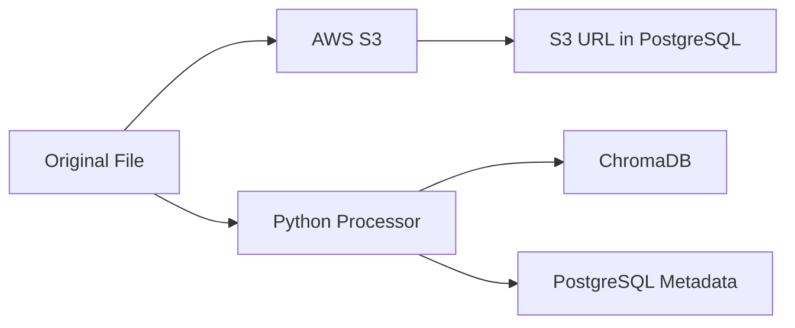
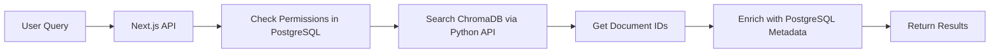

# AI Knowledge Base - Data Models Specification (v2)

## Hybrid Database Architecture

### PostgreSQL (Primary Database)
- **Purpose**: Application data, metadata, user management, analytics
- **ORM**: Prisma (same as Battalion Platform)
- **Version**: PostgreSQL 15+

### ChromaDB (Vector Search)
- **Purpose**: Document embeddings and semantic search
- **Location**: Existing implementation in `energy-data-search/`
- **Model**: HuggingFace all-MiniLM-L6-v2

### AWS S3 (File Storage)
- **Purpose**: Original document files (PDFs, DOCX, etc.)
- **Same bucket structure as Battalion Platform**

## PostgreSQL Data Models (Prisma Schema)

```prisma
// prisma/schema.prisma

generator client {
  provider = "prisma-client-js"
}

datasource db {
  provider = "postgresql"
  url      = env("DATABASE_URL")
}

// ============================================
// User & Authentication Models
// ============================================

model User {
  id              String    @id @default(cuid())
  email           String    @unique
  username        String?   @unique
  name            String?
  image           String?
  emailVerified   DateTime?
  battalionId     String?   @unique // Link to Battalion Platform user
  
  // Relations
  accounts        Account[]
  sessions        Session[]
  searchHistory   SearchHistory[]
  annotations     Annotation[]
  chatSessions    ChatSession[]
  savedSearches   SavedSearch[]
  apiKeys         ApiKey[]
  
  // Preferences
  preferences     Json      @default("{}")
  role            UserRole  @default(VIEWER)
  
  // Timestamps
  createdAt       DateTime  @default(now())
  updatedAt       DateTime  @updatedAt
  lastLoginAt     DateTime?
  
  @@index([email])
  @@index([battalionId])
}

enum UserRole {
  ADMIN
  ANALYST
  VIEWER
  DEVELOPER
}

// NextAuth.js models
model Account {
  id                String  @id @default(cuid())
  userId            String
  type              String
  provider          String
  providerAccountId String
  refresh_token     String? @db.Text
  access_token      String? @db.Text
  expires_at        Int?
  token_type        String?
  scope             String?
  id_token          String? @db.Text
  session_state     String?
  
  user User @relation(fields: [userId], references: [id], onDelete: Cascade)
  
  @@unique([provider, providerAccountId])
  @@index([userId])
}

model Session {
  id           String   @id @default(cuid())
  sessionToken String   @unique
  userId       String
  expires      DateTime
  user         User     @relation(fields: [userId], references: [id], onDelete: Cascade)
  
  @@index([userId])
}

// ============================================
// Document Models
// ============================================

model Document {
  id              String    @id @default(cuid())
  chromaId        String    @unique // ID in ChromaDB
  title           String
  type            DocumentType
  source          String
  sourceUrl       String?
  s3Key           String?   // S3 file location
  
  // Metadata
  ktc             String?   // ERCOT KTC identifier
  status          DocumentStatus @default(ACTIVE)
  visibility      Visibility @default(PUBLIC)
  version         Int       @default(1)
  fileHash        String    // SHA256 for change detection
  fileSize        Int?      // Size in bytes
  pageCount       Int?
  
  // Content metadata (actual content in ChromaDB)
  summary         String?   @db.Text
  tags            String[]
  categories      Category[]
  
  // ERCOT specific
  effectiveDate   DateTime?
  reviewDate      DateTime?
  submittedBy     String?
  priority        Priority?
  
  // Relations
  annotations     Annotation[]
  versions        DocumentVersion[]
  relatedDocs     DocumentRelation[] @relation("FromDocument")
  relatedTo       DocumentRelation[] @relation("ToDocument")
  
  // Timestamps
  createdAt       DateTime  @default(now())
  updatedAt       DateTime  @updatedAt
  publishedAt     DateTime?
  indexedAt       DateTime? // When indexed in ChromaDB
  
  @@index([type, status])
  @@index([chromaId])
  @@index([ktc])
  @@index([createdAt])
  @@index([tags])
}

enum DocumentType {
  NPRR      // Nodal Protocol Revision Request
  NOGRR     // Nodal Operating Guide Revision Request
  PROTOCOL  // Market Protocol
  GUIDE     // Operating Guide
  REPORT    // Analysis Report
  TARIFF    // Utility Tariff
  REGULATORY // Regulatory Filing
  OTHER
}

enum DocumentStatus {
  ACTIVE
  DRAFT
  ARCHIVED
  DELETED
}

enum Visibility {
  PUBLIC
  PRIVATE
  RESTRICTED
}

enum Priority {
  LOW
  MEDIUM
  HIGH
  CRITICAL
}

model DocumentVersion {
  id          String    @id @default(cuid())
  documentId  String
  document    Document  @relation(fields: [documentId], references: [id], onDelete: Cascade)
  version     Int
  changes     Json      // Diff or change description
  fileHash    String
  s3Key       String?
  createdBy   String?
  createdAt   DateTime  @default(now())
  
  @@unique([documentId, version])
  @@index([documentId])
}

model DocumentRelation {
  id             String    @id @default(cuid())
  fromDocumentId String
  toDocumentId   String
  relationType   RelationType
  
  fromDocument   Document  @relation("FromDocument", fields: [fromDocumentId], references: [id])
  toDocument     Document  @relation("ToDocument", fields: [toDocumentId], references: [id])
  
  createdAt      DateTime  @default(now())
  
  @@unique([fromDocumentId, toDocumentId, relationType])
  @@index([fromDocumentId])
  @@index([toDocumentId])
}

enum RelationType {
  SUPERSEDES
  REFERENCES
  RELATED
  CHILD
  PARENT
}

model Category {
  id          String     @id @default(cuid())
  name        String     @unique
  description String?
  parentId    String?
  parent      Category?  @relation("CategoryHierarchy", fields: [parentId], references: [id])
  children    Category[] @relation("CategoryHierarchy")
  documents   Document[]
  
  createdAt   DateTime   @default(now())
  updatedAt   DateTime   @updatedAt
  
  @@index([name])
}

// ============================================
// Search & Annotations
// ============================================

model SearchHistory {
  id           String    @id @default(cuid())
  userId       String
  user         User      @relation(fields: [userId], references: [id], onDelete: Cascade)
  query        String
  filters      Json?
  resultCount  Int
  clickedResults Json?   // Array of document IDs that were clicked
  
  createdAt    DateTime  @default(now())
  
  @@index([userId, createdAt])
  @@index([query])
}

model SavedSearch {
  id            String    @id @default(cuid())
  userId        String
  user          User      @relation(fields: [userId], references: [id], onDelete: Cascade)
  name          String
  description   String?
  query         String
  filters       Json?
  alertEnabled  Boolean   @default(false)
  alertFrequency String?  // 'daily', 'weekly', 'monthly'
  lastRun       DateTime?
  
  createdAt     DateTime  @default(now())
  updatedAt     DateTime  @updatedAt
  
  @@unique([userId, name])
  @@index([userId])
}

model Annotation {
  id          String    @id @default(cuid())
  documentId  String
  document    Document  @relation(fields: [documentId], references: [id], onDelete: Cascade)
  userId      String
  user        User      @relation(fields: [userId], references: [id], onDelete: Cascade)
  
  text        String    @db.Text
  position    Json      // { page?: number, start: number, end: number }
  type        AnnotationType
  color       String?
  
  resolved    Boolean   @default(false)
  replies     AnnotationReply[]
  
  createdAt   DateTime  @default(now())
  updatedAt   DateTime  @updatedAt
  
  @@index([documentId])
  @@index([userId])
}

enum AnnotationType {
  NOTE
  HIGHLIGHT
  QUESTION
  CORRECTION
}

model AnnotationReply {
  id           String     @id @default(cuid())
  annotationId String
  annotation   Annotation @relation(fields: [annotationId], references: [id], onDelete: Cascade)
  userId       String
  text         String     @db.Text
  
  createdAt    DateTime   @default(now())
  
  @@index([annotationId])
}

// ============================================
// AI Chat Models
// ============================================

model ChatSession {
  id          String    @id @default(cuid())
  userId      String
  user        User      @relation(fields: [userId], references: [id], onDelete: Cascade)
  title       String?
  
  messages    ChatMessage[]
  
  createdAt   DateTime  @default(now())
  updatedAt   DateTime  @updatedAt
  
  @@index([userId, updatedAt])
}

model ChatMessage {
  id          String    @id @default(cuid())
  sessionId   String
  session     ChatSession @relation(fields: [sessionId], references: [id], onDelete: Cascade)
  
  role        MessageRole
  content     String    @db.Text
  
  // AI metadata
  model       String?   // 'gpt-4', 'gpt-3.5-turbo', etc.
  tokens      Json?     // { prompt: number, completion: number }
  
  // Context documents from ChromaDB
  contextDocs Json?     // Array of document IDs used as context
  
  createdAt   DateTime  @default(now())
  
  @@index([sessionId])
}

enum MessageRole {
  USER
  ASSISTANT
  SYSTEM
}

// ============================================
// Analytics Models
// ============================================

model AnalyticsEvent {
  id          String    @id @default(cuid())
  userId      String?
  sessionId   String?
  
  eventType   EventType
  eventData   Json
  
  // Context
  documentId  String?
  searchQuery String?
  
  // Technical
  ipAddress   String?
  userAgent   String?
  
  timestamp   DateTime  @default(now())
  
  @@index([eventType, timestamp])
  @@index([userId, timestamp])
  @@index([documentId])
}

enum EventType {
  SEARCH
  VIEW_DOCUMENT
  DOWNLOAD
  ANNOTATION
  SHARE
  AI_CHAT
  API_CALL
}

model ApiMetric {
  id          String    @id @default(cuid())
  endpoint    String
  method      String
  duration    Int       // milliseconds
  status      Int       // HTTP status code
  userId      String?
  
  timestamp   DateTime  @default(now())
  
  @@index([endpoint, timestamp])
  @@index([status])
}

// ============================================
// API & System Models
// ============================================

model ApiKey {
  id          String    @id @default(cuid())
  userId      String
  user        User      @relation(fields: [userId], references: [id], onDelete: Cascade)
  
  name        String
  key         String    @unique // Hashed
  prefix      String    // First 8 chars for identification
  
  permissions String[]
  rateLimit   Int?      // Requests per hour
  
  lastUsedAt  DateTime?
  expiresAt   DateTime?
  revokedAt   DateTime?
  
  createdAt   DateTime  @default(now())
  
  @@index([userId])
  @@index([key])
}

model SystemLog {
  id          String    @id @default(cuid())
  level       LogLevel
  message     String
  context     Json?
  
  // Indexing specific logs
  indexingStats Json?   // { filesProcessed: number, errors: number, etc. }
  
  timestamp   DateTime  @default(now())
  
  @@index([level, timestamp])
}

enum LogLevel {
  DEBUG
  INFO
  WARNING
  ERROR
  CRITICAL
}
```

## ChromaDB Data Structure

### Collection: `energy_documents`
```python
# ChromaDB document structure
{
    "id": "doc_chromaId_12345",  # Unique ID
    "documents": ["Full text content of the document chunk..."],
    "metadatas": [{
        "source": "/path/to/document.pdf",
        "document_id": "postgresql_document_id",
        "type": "NPRR",
        "page": 5,
        "chunk": 2,
        "total_chunks": 10,
        "ktc": "KTC-123",
        "date": "2024-01-15",
        "tags": ["market-rules", "battery-storage"]
    }],
    "embeddings": [[0.1, 0.2, ...]]  # 384-dimensional vector
}
```

## Data Flow Between Systems

### Document Indexing Flow


### Search Flow


## Key Relationships

### Document Storage
- **PostgreSQL**: Stores document metadata, relationships, permissions
- **ChromaDB**: Stores document content chunks and embeddings
- **S3**: Stores original files

### User Data
- **PostgreSQL Only**: All user data, preferences, history

### Search Data
- **ChromaDB**: Performs actual search
- **PostgreSQL**: Records search history, saved searches

## Migration from v1 Schema

### Removed Tables
- ❌ `Embedding` table (now in ChromaDB)
- ❌ `MarketData` table (not needed for MVP)
- ❌ `Report` table (simplified to analytics)
- ❌ `Notification` table (can add later)

### Simplified Models
- Consolidated ERCOT-specific fields into Document model
- Removed complex compliance tracking (can add later)
- Simplified analytics to essential events only

## Indexes Strategy

### PostgreSQL Indexes
```sql
-- High-frequency queries
CREATE INDEX idx_documents_type_status ON documents(type, status);
CREATE INDEX idx_documents_chromaid ON documents(chroma_id);
CREATE INDEX idx_search_history_user ON search_history(user_id, created_at DESC);
CREATE INDEX idx_annotations_document ON annotations(document_id);

-- Full-text search backup (if needed)
CREATE INDEX idx_documents_title ON documents USING gin(to_tsvector('english', title));

-- JSONB indexes for tags
CREATE INDEX idx_documents_tags ON documents USING gin(tags);
```

### ChromaDB Indexes
- Automatically managed by ChromaDB
- HNSW index for vector similarity
- Metadata filtering indexes

## Data Retention Policies

### PostgreSQL
- User data: Retained until account deletion
- Search history: 90 days rolling window
- Chat sessions: 30 days for non-saved conversations
- Analytics events: 1 year
- System logs: 30 days

### ChromaDB
- Document embeddings: Retained indefinitely
- Updated when source document changes (SHA256 hash comparison)

## Backup Strategy

### PostgreSQL
- Daily automated backups via pg_dump
- Point-in-time recovery enabled
- Replicated to standby instance

### ChromaDB
- Weekly snapshots of persist directory
- Stored in S3 with versioning

### S3
- Versioning enabled
- Cross-region replication for critical documents
- Lifecycle policies for old versions

## Performance Considerations

### PostgreSQL
- Connection pooling via Prisma
- Prepared statements for common queries
- Materialized views for analytics dashboards
- Partitioning for large tables (analytics_events)

### ChromaDB
- Batch processing for indexing
- Appropriate chunk sizes (1000 chars default)
- Limit search results (max 100)
- Use metadata filtering to reduce search space

## Security

### PostgreSQL
- Row-level security for multi-tenant data
- Encrypted connections (SSL/TLS)
- Encrypted at rest
- Regular security updates

### ChromaDB
- Read-only access from web application
- Write access only from indexing service
- No direct internet exposure

### Data Privacy
- PII minimization
- GDPR compliance ready
- Audit logging for all data access
- Encryption for sensitive fields