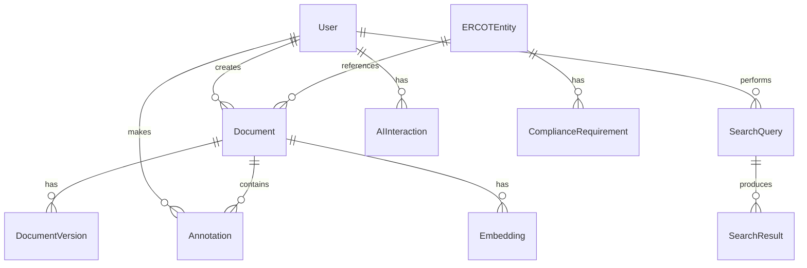

# AI Knowledge Base - Data Models Specification

## Database Architecture

### Primary Database: PostgreSQL
- Version: 15+
- Extensions: pgvector, pg_trgm, uuid-ossp
- Partitioning: Time-based for historical data
- Replication: Master-slave configuration

### Vector Database: ChromaDB
- For semantic search and embeddings
- Collections for different document types
- Metadata filtering support

### Cache Layer: Redis
- Session management
- Query result caching
- Real-time data updates

## Core Data Models

### 1. User & Authentication

#### User
```typescript
interface User {
  id: string                    // UUID
  email: string                 // Unique
  username: string              // Unique
  firstName: string
  lastName: string
  avatar?: string               // URL
  role: UserRole
  permissions: Permission[]
  organizationId: string
  battalionUserId?: string      // Battalion Platform integration
  settings: UserSettings
  status: 'active' | 'inactive' | 'suspended'
  emailVerified: boolean
  mfaEnabled: boolean
  createdAt: Date
  updatedAt: Date
  lastLoginAt?: Date
}

enum UserRole {
  ADMIN = 'admin',
  ANALYST = 'analyst',
  VIEWER = 'viewer',
  DEVELOPER = 'developer',
  EXTERNAL = 'external'
}
```

#### Session
```typescript
interface Session {
  id: string
  userId: string
  accessToken: string
  refreshToken: string
  ipAddress: string
  userAgent: string
  expiresAt: Date
  createdAt: Date
}
```

#### Permission
```typescript
interface Permission {
  id: string
  name: string
  resource: string
  action: string
  conditions?: Record<string, any>
}
```

### 2. Document Models

#### Document
```typescript
interface Document {
  id: string                    // UUID
  title: string
  content: string               // Full text content
  contentHash: string           // SHA-256 hash
  type: DocumentType
  format: DocumentFormat
  source: DocumentSource
  sourceUrl?: string
  version: number
  parentId?: string             // For document relationships
  metadata: DocumentMetadata
  tags: string[]
  categories: Category[]
  embeddings?: number[]         // Vector embeddings
  searchVector?: string         // tsvector for full-text search
  status: DocumentStatus
  visibility: 'public' | 'private' | 'restricted'
  createdBy: string            // User ID
  updatedBy: string
  createdAt: Date
  updatedAt: Date
  publishedAt?: Date
  expiresAt?: Date
}

enum DocumentType {
  NPRR = 'nprr',
  NOGRR = 'nogrr',
  PROTOCOL = 'protocol',
  GUIDE = 'guide',
  REPORT = 'report',
  ANALYSIS = 'analysis',
  REGULATORY = 'regulatory'
}

enum DocumentFormat {
  PDF = 'pdf',
  DOCX = 'docx',
  XLSX = 'xlsx',
  PPTX = 'pptx',
  HTML = 'html',
  MARKDOWN = 'markdown',
  JSON = 'json'
}

interface DocumentMetadata {
  author?: string
  organization?: string
  ktc?: string                 // ERCOT KTC identifier
  effectiveDate?: Date
  reviewDate?: Date
  complianceRequired?: boolean
  relatedDocIds?: string[]
  customFields?: Record<string, any>
}
```

#### DocumentVersion
```typescript
interface DocumentVersion {
  id: string
  documentId: string
  version: number
  content: string
  changes: ChangeLog[]
  createdBy: string
  createdAt: Date
  comment?: string
}
```

#### Annotation
```typescript
interface Annotation {
  id: string
  documentId: string
  userId: string
  text: string
  position: {
    page?: number
    start: number
    end: number
  }
  type: 'note' | 'highlight' | 'question' | 'correction'
  color?: string
  replies?: AnnotationReply[]
  resolved: boolean
  createdAt: Date
  updatedAt: Date
}
```

### 3. Search Models

#### SearchQuery
```typescript
interface SearchQuery {
  id: string
  userId: string
  query: string
  filters: SearchFilters
  searchType: 'semantic' | 'fulltext' | 'hybrid'
  results: SearchResult[]
  resultCount: number
  executionTime: number       // milliseconds
  createdAt: Date
}

interface SearchFilters {
  documentTypes?: DocumentType[]
  dateRange?: {
    start: Date
    end: Date
  }
  sources?: string[]
  tags?: string[]
  categories?: string[]
  metadata?: Record<string, any>
}
```

#### SearchResult
```typescript
interface SearchResult {
  id: string
  queryId: string
  documentId: string
  score: number               // Relevance score 0-1
  highlights: TextHighlight[]
  snippet: string
  position: number            // Result position
}

interface TextHighlight {
  field: string
  fragments: string[]
}
```

#### SavedSearch
```typescript
interface SavedSearch {
  id: string
  userId: string
  name: string
  description?: string
  query: string
  filters: SearchFilters
  alertEnabled: boolean
  alertFrequency?: 'daily' | 'weekly' | 'monthly'
  lastRun?: Date
  createdAt: Date
  updatedAt: Date
}
```

### 4. ERCOT-Specific Models

#### ERCOTEntity
```typescript
interface ERCOTEntity {
  id: string
  type: 'NPRR' | 'NOGRR' | 'ESR' | 'BESS'
  identifier: string           // e.g., "NPRR1234"
  title: string
  description: string
  status: ERCOTStatus
  priority: 'low' | 'medium' | 'high' | 'critical'
  ktc?: string
  submittedBy: string
  submittedDate: Date
  effectiveDate?: Date
  documents: string[]          // Document IDs
  relatedEntities: string[]
  timeline: TimelineEvent[]
  metadata: Record<string, any>
  createdAt: Date
  updatedAt: Date
}

enum ERCOTStatus {
  DRAFT = 'draft',
  SUBMITTED = 'submitted',
  UNDER_REVIEW = 'under_review',
  APPROVED = 'approved',
  REJECTED = 'rejected',
  IMPLEMENTED = 'implemented',
  WITHDRAWN = 'withdrawn'
}
```

#### ComplianceRequirement
```typescript
interface ComplianceRequirement {
  id: string
  entityId: string            // ERCOTEntity ID
  requirement: string
  description: string
  category: string
  deadline?: Date
  penalty?: string
  status: 'pending' | 'in_progress' | 'compliant' | 'non_compliant'
  evidence?: string[]          // Document IDs
  notes?: string
  createdAt: Date
  updatedAt: Date
}
```

#### MarketData
```typescript
interface MarketData {
  id: string
  timestamp: Date
  dataType: string
  market: 'DAM' | 'RTM' | 'AS'  // Day-Ahead, Real-Time, Ancillary Services
  values: Record<string, number>
  unit: string
  location?: string
  metadata?: Record<string, any>
  createdAt: Date
}
```

### 5. Analytics Models

#### AnalyticsEvent
```typescript
interface AnalyticsEvent {
  id: string
  userId?: string
  sessionId: string
  eventType: EventType
  eventData: Record<string, any>
  timestamp: Date
  ipAddress?: string
  userAgent?: string
}

enum EventType {
  SEARCH = 'search',
  VIEW_DOCUMENT = 'view_document',
  DOWNLOAD = 'download',
  ANNOTATION = 'annotation',
  SHARE = 'share',
  API_CALL = 'api_call'
}
```

#### Report
```typescript
interface Report {
  id: string
  name: string
  description: string
  type: ReportType
  schedule?: CronExpression
  recipients?: string[]        // Email addresses
  parameters: Record<string, any>
  lastRun?: Date
  nextRun?: Date
  format: 'pdf' | 'excel' | 'json'
  createdBy: string
  createdAt: Date
  updatedAt: Date
}
```

#### Metric
```typescript
interface Metric {
  id: string
  name: string
  type: 'counter' | 'gauge' | 'histogram'
  value: number
  tags: Record<string, string>
  timestamp: Date
}
```

### 6. AI/ML Models

#### AIInteraction
```typescript
interface AIInteraction {
  id: string
  userId: string
  type: 'chat' | 'summarization' | 'generation' | 'analysis'
  input: {
    prompt: string
    context?: string[]
    documentIds?: string[]
    parameters?: Record<string, any>
  }
  output: {
    response: string
    sources?: Source[]
    confidence?: number
    metadata?: Record<string, any>
  }
  model: string
  tokensUsed: {
    input: number
    output: number
    total: number
  }
  cost?: number
  executionTime: number
  feedback?: {
    rating?: number
    comment?: string
  }
  createdAt: Date
}
```

#### Embedding
```typescript
interface Embedding {
  id: string
  documentId: string
  chunkId: string
  text: string
  vector: number[]             // 1536 dimensions for OpenAI
  model: string                // e.g., "text-embedding-ada-002"
  metadata?: Record<string, any>
  createdAt: Date
}
```

### 7. System Models

#### AuditLog
```typescript
interface AuditLog {
  id: string
  userId?: string
  action: string
  resource: string
  resourceId: string
  changes?: Record<string, any>
  ipAddress?: string
  userAgent?: string
  result: 'success' | 'failure'
  errorMessage?: string
  timestamp: Date
}
```

#### Notification
```typescript
interface Notification {
  id: string
  userId: string
  type: NotificationType
  title: string
  message: string
  data?: Record<string, any>
  read: boolean
  actionUrl?: string
  expiresAt?: Date
  createdAt: Date
}

enum NotificationType {
  INFO = 'info',
  SUCCESS = 'success',
  WARNING = 'warning',
  ERROR = 'error',
  DOCUMENT_UPDATE = 'document_update',
  COMPLIANCE_ALERT = 'compliance_alert',
  SYSTEM = 'system'
}
```

#### ApiKey
```typescript
interface ApiKey {
  id: string
  userId: string
  name: string
  key: string                  // Hashed
  prefix: string               // First 8 chars for identification
  permissions: string[]
  rateLimit?: number
  expiresAt?: Date
  lastUsedAt?: Date
  createdAt: Date
  revokedAt?: Date
}
```

## Database Indexes

### PostgreSQL Indexes
```sql
-- Users
CREATE INDEX idx_users_email ON users(email);
CREATE INDEX idx_users_organization ON users(organization_id);

-- Documents
CREATE INDEX idx_documents_type ON documents(type);
CREATE INDEX idx_documents_created ON documents(created_at);
CREATE INDEX idx_documents_search ON documents USING GIN(search_vector);
CREATE INDEX idx_documents_tags ON documents USING GIN(tags);

-- Search Queries
CREATE INDEX idx_queries_user ON search_queries(user_id);
CREATE INDEX idx_queries_created ON search_queries(created_at);

-- ERCOT Entities
CREATE INDEX idx_ercot_type_status ON ercot_entities(type, status);
CREATE INDEX idx_ercot_identifier ON ercot_entities(identifier);

-- Analytics
CREATE INDEX idx_analytics_event ON analytics_events(event_type, timestamp);
CREATE INDEX idx_analytics_user ON analytics_events(user_id, timestamp);
```

### ChromaDB Collections
```python
collections = {
    "documents": {
        "embedding_function": "openai",
        "metadata": ["type", "source", "date", "tags"]
    },
    "queries": {
        "embedding_function": "sentence-transformers",
        "metadata": ["user_id", "timestamp"]
    }
}
```

## Data Relationships

### Entity Relationships


## Data Migration Strategy

### Version Control
- Migrations tracked in `migrations/` directory
- Rollback capability for each migration
- Schema version stored in database

### Migration Process
1. Development environment testing
2. Staging environment validation
3. Production deployment with backup
4. Monitoring and rollback plan

## Data Retention Policies

### Retention Periods
- User data: Indefinite (until account deletion)
- Documents: Based on regulatory requirements
- Search queries: 90 days
- Analytics events: 1 year
- Audit logs: 7 years
- AI interactions: 30 days (anonymized after)

### GDPR Compliance
- Right to access
- Right to rectification
- Right to erasure
- Data portability
- Anonymization procedures